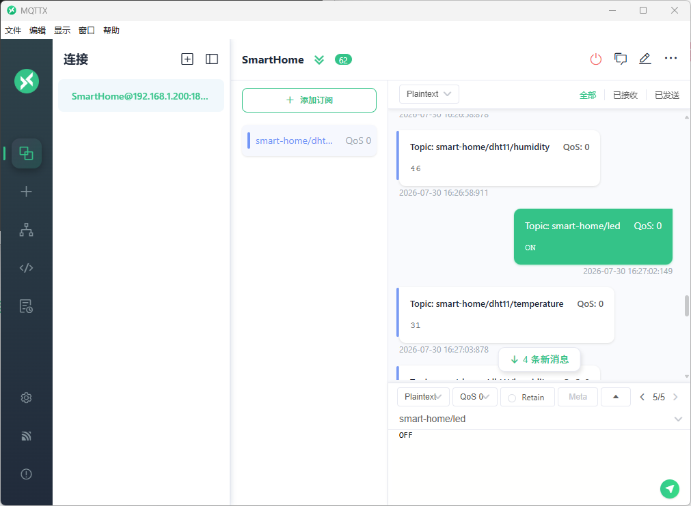

# i.MX6ULL 智能家居温湿度采集系统

[](https://www.nxp.com/products/processors-and-microcontrollers/arm-processors/i-mx-applications-processors/i-mx-6-processors/i-mx-6ull-single-core-processor-with-arm-cortex-a7-core:i.MX6ULL)
[](https://www.eclipse.org/paho/)
[]()
[]()

基于 **NXP i.MX6ULL** 嵌入式平台搭建的智能家居温湿度采集系统。打通嵌入式 Linux 全技术栈：**内核驱动 → 用户态进程通信 → MQTT 云平台 → 微信小程序端**。

---

## 系统架构

```
```

### 通信协议分层

| 层级 | 协议 | 端口 | 方向 | 说明 |
|---|---|---|---|---|
| **驱动层** | 字符设备 | - | 内核 ↔ 用户态 | DHT11 GPIO 中断读取 |
| **进程通信层** | JSON-RPC | TCP :8888 | rpc_client ↔ rpc_server | 前后台分离（可选） |
| **远程通信层** | MQTT 3.1.1 | TCP :1883 | 开发板 ↔ Broker | Eclipse Paho C 库 |
| **小程序层** | MQTT over WebSocket | TCP :8083 | 小程序 ↔ Broker | 自定义 MQTT WS 客户端 |

---

## 效果展示 / Screenshots

| 开发板实物 | 微信小程序界面 | MQTTX 监控 |
|---|---|---|
|  |  |  |
| i.MX6ULL 运行 DHT11 驱动与 MQTT 客户端 | 实时温湿度显示与 LED 远程控制 | 通过 MQTTX 订阅验证温湿度数据 |

---

## 功能特性

- **DHT11 内核驱动** — 字符设备驱动，GPIO 中断方式精确采集时序，支持 CRC 校验
- **JSON-RPC 进程通信** — 前后台分离架构，降低模块耦合
- **MQTT 远程通信** — Eclipse Paho 开源库，稳定可靠的 MQTT 3.1.1 实现
- **微信小程序** — 自定义 MQTT over WebSocket 客户端，无需第三方库
- **双向控制** — 开发板实时上传温湿度，小程序远程控制 LED
- **自动重连** — MQTT 断线自动重连，保证链路稳定
- **动态模块加载** — `insmod` 加载驱动，`mknod` 创建设备节点

---

## 硬件组成

| 组件 | 型号/接口 | 说明 |
|---|---|---|
| 主控 | NXP i.MX6ULL (Cortex-A7) | 正点原子阿尔法开发板 |
| 传感器 | DHT11 | 单总线数字温湿度传感器，GPIO4 |
| LED | 板载 sys-led | `/sys/class/leds/sys-led/brightness` |
| 网络 | 以太网 (100M) | 与 Ubuntu VM 直连 |

---

## MQTT 通信协议

### Topic 定义

| Topic | 方向 | Payload | QoS | 说明 |
|---|---|---|---|---|
| `smart-home/dht11/temperature` | 开发板 → Broker | `"25"` (整数) | 0 | 温度，摄氏度 |
| `smart-home/dht11/humidity` | 开发板 → Broker | `"60"` (整数) | 0 | 湿度，百分比 |
| `smart-home/led` | Broker → 开发板 | `"ON"` / `"OFF"` | 0 | LED 开关控制 |

### 发布频率

每 5 秒发布一次温湿度数据。

### 心跳间隔

30 秒（由 Paho MQTT 库内部维护）。

---

## 目录结构

```
imx6ull-mini-smart-home/
├── 02_dht11_drv_imx6ull/         # DHT11 内核驱动模块
│   ├── dht11_drv.c               # 字符设备驱动主文件 (中断方式)
│   ├── dht11_sysfs.c             # 用户态 sysfs 读取（备选方案）
│   ├── dht11_test.c              # 驱动测试程序
│   └── Makefile                  # 交叉编译 (arm-poky-linux-gnueabi)
│
├── json-rpc_control-hardware/    # JSON-RPC 前后台分离应用
│   ├── rpc_server/               # 后台服务（硬件交互）
│   ├── rpc_client/               # 前台客户端（Qt 集成）
│   ├── jsonrpc-c/                # git submodule: JSON-RPC C 库
│   └── libev/                    # git submodule: 事件循环库
│
├── mqtt_client/                  # [新增] MQTT 远程通信客户端
│   ├── mqtt_client.c             # 主程序（Paho MQTT 同步 API）
│   ├── Makefile                  # 交叉编译 Makefile
│   ├── paho_include/             # Paho MQTT 头文件 (6个 .h)
│   └── README.md                 # 编译与使用说明
│
├── wechat-miniapp/               # [新增] 微信小程序
│   ├── project.config.json       # 项目配置 (AppID)
│   ├── app.js / app.json         # 应用入口与配置
│   ├── pages/index/              # 主页面
│   │   ├── index.js              # 自定义 MQTT over WebSocket
│   │   ├── index.wxml            # 温度/湿度/LED 开关 UI
│   │   └── index.wxss            # 浅色主题样式
│   └── sitemap.json
│
├── README.md                     # 本文件
├── TROUBLESHOOTING.md            # 常见问题排查（module_layout 错误）
└── .gitignore
```

---

## 环境依赖

### 硬件

| 组件 | 说明 |
|---|---|
| 主控 | i.MX6ULL 开发板（正点原子阿尔法） |
| 传感器 | DHT11 温湿度传感器 (GPIO4) |
| LED | 板载 sys-led |
| 网络 | 以太网直连 Ubuntu VM |

### 软件

| 工具 | 版本 | 用途 |
|---|---|---|
| Linux 内核 | 4.1.15 | 开发板系统 |
| 交叉编译器 | arm-poky-linux-gnueabi-gcc (5.3.0) | 编译 ARM 程序 |
| Paho MQTT C | 1.3.13 | MQTT 客户端库 |
| Mosquitto | 1.4.15 | MQTT Broker (在 Ubuntu VM 上) |
| 微信开发者工具 | 最新版 | 小程序开发调试 |
| MQTTX (可选) | 最新版 | 桌面端 MQTT 调试工具 |

---

## 快速开始

### 1. 搭建 Mosquitto Broker（在 Ubuntu VM 上）

```bash
# 安装
sudo apt install mosquitto mosquitto-clients -y

# 配置：允许外部连接 + WebSocket 支持
sudo sh -c 'echo "listener 1883 0.0.0.0" >> /etc/mosquitto/mosquitto.conf'
sudo sh -c 'echo -e "\nlistener 8083\nprotocol websockets" >> /etc/mosquitto/mosquitto.conf'
sudo systemctl restart mosquitto

# 验证
sudo netstat -tlnp | grep -E "1883|8083"
```

### 2. 交叉编译 Paho MQTT C 库

```bash
# 下载 paho.mqtt.c 源码
tar xjf paho.mqtt.c.tar.bz2
cd paho.mqtt.c

# 加载 SDK 环境
source /opt/fsl-imx-x11/4.1.15-2.1.0/environment-setup-cortexa7hf-neon-poky-linux-gnueabi

# 编译（会自动使用交叉编译器）
make
```

编译产物位于 `build/output/libpaho-mqtt3c.so.1.3`（ARM 架构）。

### 3. 编译程序

#### 3.1 编译 MQTT 客户端

```bash
cd mqtt_client
make clean && make
```

#### 3.2 编译内核驱动

```bash
cd 02_dht11_drv_imx6ull
make clean && make
```

#### 3.3 编译 RPC 服务器（可选）

```bash
cd json-rpc_control-hardware/rpc_server
make clean && make
```

---

## 部署与运行

### 1. 传送文件到开发板

```bash
# 假设开发板 IP 为 192.168.1.101
scp mqtt_client/mqtt_client root@192.168.1.101:/root/
scp 02_dht11_drv_imx6ull/dht11_drv.ko root@192.168.1.101:/root/
scp paho.mqtt.c/build/output/libpaho-mqtt3c.so.1.3 root@192.168.1.101:/usr/lib/
ssh root@192.168.1.101 "ln -sf /usr/lib/libpaho-mqtt3c.so.1.3 /usr/lib/libpaho-mqtt3c.so"
```

### 2. 开发板上运行

```bash
# 加载驱动
insmod /root/dht11_drv.ko
cat /proc/devices | grep dht11
mknod /dev/mydht11 c <主设备号> 0

# 启动 MQTT 客户端
/root/mqtt_client
```

### 3. 验证数据

在 Ubuntu VM 上订阅 MQTT 主题：

```bash
mosquitto_sub -h 192.168.1.200 -t "smart-home/#" -v
```

### 4. 测试 LED 远程控制

```bash
mosquitto_pub -h 192.168.1.200 -t "smart-home/led" -m "ON"
mosquitto_pub -h 192.168.1.200 -t "smart-home/led" -m "OFF"
```

---

## 微信小程序

### 打开方式

1. 下载并打开 **微信开发者工具**
2. 导入项目 → 选择 `wechat-miniapp/` 目录
3. 输入 AppID: `wx43b7fb5fdb7d72ec`
4. **关键步骤**：详情 → 本地设置 → 勾选 **"不校验合法域名、web-view（业务域名）、TLS 版本及 HTTPS 证书"**
5. 点击编译

### 界面说明

| 区域 | 显示内容 |
|---|---|
| 顶部状态栏 | 连接状态指示（在线/离线） |
| 传感器卡片 | 实时温度 (°C) 和湿度 (%) |
| 控制卡片 | LED 开关切换按钮 |
| 底部 | 当前 MQTT Broker 地址 |

### 自定义 MQTT 客户端

小程序使用纯 JavaScript 实现 MQTT over WebSocket 协议，**不依赖任何第三方库**。完整实现了 MQTT 3.1.1 的 CONNECT、SUBSCRIBE、PUBLISH、PINGREQ 等报文编解码。

> 开发环境 WebSocket 地址：`ws://192.168.1.200:8083/mqtt`  
> 如需连接公网 EMQX，改为 `wss://broker.emqx.io:8084/mqtt`

---

## 驱动工作原理

1. `read()` 时 GPIO4 发送 20ms 低电平起始信号
2. 切换 GPIO 为输入，注册双沿中断
3. DHT11 返回 40bit 数据帧（含校验和）
4. 中断服务程序记录 84 个时间戳，解析温度/湿度
5. CRC 校验通过后存入环形缓冲区，唤醒用户进程

---

## 网络拓扑参考

### 开发板直连方案

```
┌──────────────┐  以太网  ┌──────────────┐  WiFi   ┌───────┐
│  开发板       │─────────│  Windows PC  │────────▶│ 互联网 │
│ 192.168.1.101│          │ 192.168.1.100│         └───────┘
└──────────────┘          └──────┬───────┘
                                 │ 桥接模式
                          ┌──────▼───────┐
                          │ Ubuntu VM    │
                          │ 192.168.1.200│
                          │ Mosquitto    │
                          └──────────────┘
```

所有设备在同一网段 `192.168.1.x/24` 下，VM 运行 Mosquitto Broker，开发板和小程序都连接到 VM。

---

## 问题排查

| 现象 | 可能原因 | 解决方案 |
|---|---|---|
| `MQTT error: -2147483631` | Socket 连接断开 | 确保 Mosquitto 正在运行，检查网络 |
| `Connection refused` | Mosquitto 未启动或端口不对 | `sudo systemctl status mosquitto` |
| `gethostbyname failed` | DNS 解析失败 | 使用 IP 地址代替域名，或配置 `/etc/resolv.conf` |
| `gpio_request failed` | DHT11 驱动冲突 | 先 `killall rpc_server`，再运行 mqtt_client |
| `no symbol version for module_layout` | 内核版本不匹配 | 详见 `TROUBLESHOOTING.md` |
| 小程序连不上 | 未勾选"不校验合法域名" | 在开发者工具中勾选该选项 |

---

## License

GPL v2
